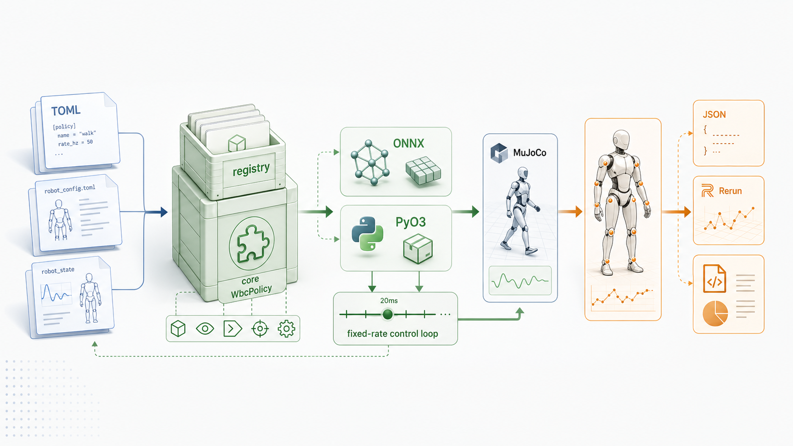
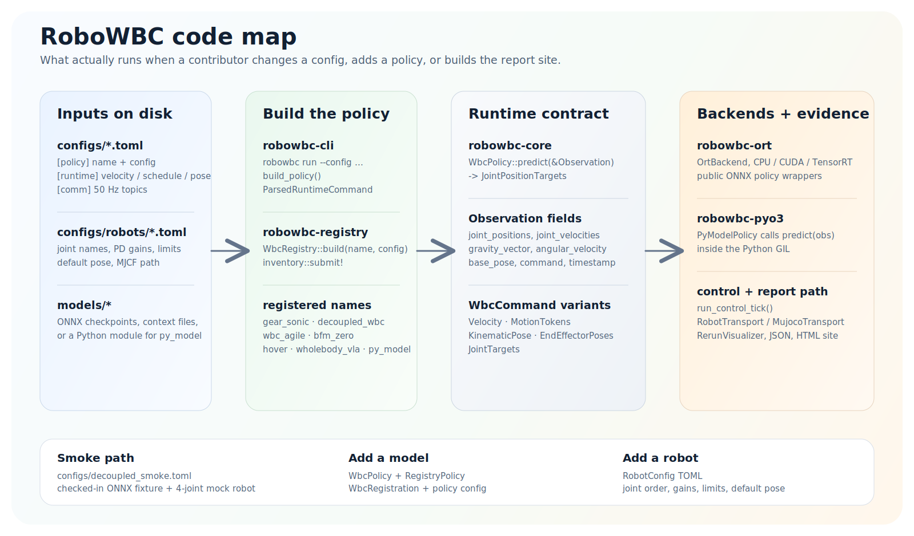

# RoboWBC

<p align="center">
  
</p>

Linux-only embedded runtime for humanoid whole-body-control policy inference.

<p>
  <a href="https://miaodx.com/robowbc/"><strong>Open Live Policy Reports</strong></a>
  ·
  <a href="docs/getting-started.md"><strong>Getting Started</strong></a>
  ·
  <a href="docs/architecture.md"><strong>Architecture</strong></a>
  ·
  <a href="docs/python-sdk.md"><strong>Python SDK</strong></a>
  ·
  <a href="docs/founding-document.md"><strong>Founding Document</strong></a>
</p>

RoboWBC is an embedded runtime for loading multiple WBC policies through one
customer-facing contract. The primary adoption path is the Python SDK
(`Registry`, `Observation`, `Policy`, and `MujocoSession`). Embedded Rust is
the secondary path for teams that want to own the host loop directly. The CLI
stays in the repo as the verification, benchmarking, and reporting surface for
the same runtime.

RoboWBC is a Linux-only project. The runtime backends fail fast on non-Linux
targets instead of carrying partial or unverified platform fallbacks.

Run `make help` to see the repo-level commands for build, validation,
benchmarks, site generation, and local serving.

## Embedded Runtime Surface

Python is the primary embedded runtime seam:

```python
from robowbc import Observation, Registry, VelocityCommand

policy = Registry.build("decoupled_wbc", "configs/decoupled_smoke.toml")
print(policy.capabilities().supported_commands)

obs = Observation(
    joint_positions=[0.0] * 4,
    joint_velocities=[0.0] * 4,
    gravity_vector=[0.0, 0.0, -1.0],
    command=VelocityCommand(linear=[0.2, 0.0, 0.0], angular=[0.0, 0.0, 0.1]),
)
targets = policy.predict(obs)
print(targets.positions)
```

Embedded Rust is the secondary path:

```rust
use robowbc_core::WbcCommandKind;
use robowbc_registry::WbcRegistry;

let policy = WbcRegistry::build("my_policy", &policy_cfg)?;
let capabilities = policy.capabilities();
assert!(capabilities.supports(WbcCommandKind::Velocity));
```

Phase 1 deliberately keeps the surface narrow:

- Python SDK first, embedded runtime second
- no `server/daemon` surface
- no `ROS2` or `zenoh` customer API
- no public `EndEffectorPoses` surface
- no new wrapper families beyond the shipped policy wrappers

## System Architecture



The hero image gives the repo shape at a glance. The SVG is the exact system
map: current configs, registry names, core contract fields, ORT/PyO3 backends,
transports, and report artifacts.

## Published HTML reports

These pages are generated by the `showcase` job on `main` and published
directly from the CI artifact bundle:

| Page | Link | Purpose |
|------|------|---------|
| Site home | <https://miaodx.com/robowbc/> | Comparison-first overview across all generated policy cards |
| NVIDIA benchmarks | <https://miaodx.com/robowbc/benchmarks/nvidia/> | Normalized RoboWBC-vs-official benchmark comparison page |
| GEAR-SONIC detail | <https://miaodx.com/robowbc/policies/gear_sonic/> | Planner-driven velocity showcase, logs, JSON, `.rrd`, and proof-pack assets |
| Decoupled WBC detail | <https://miaodx.com/robowbc/policies/decoupled_wbc/> | GR00T WholeBodyControl locomotion showcase with the same staged command profile |
| WBC-AGILE detail | <https://miaodx.com/robowbc/policies/wbc_agile/> | Published G1 recurrent checkpoint detail page and raw artifacts |
| BFM-Zero detail | <https://miaodx.com/robowbc/policies/bfm_zero/> | Prompt-conditioned tracking showcase with context-bundle artifacts |

## What ships today

| Area | Status |
|------|--------|
| Runtime | Rust workspace with registry-driven policy loading, ONNX Runtime and PyO3 backends, MuJoCo and communication transports, plus JSON and Rerun reporting |
| Live public-policy paths | `gear_sonic`, `decoupled_wbc`, `wbc_agile`, `bfm_zero` |
| Honest blocked wrappers | `hover` needs a user-exported checkpoint, `wholebody_vla` still lacks a runnable public upstream release |
| Published visual report | The `main` workflow is wired to build the same HTML report in CI and publish it to the live report link above |

## Policy status

| Policy | Status | Public assets | Example config | Notes |
|--------|--------|---------------|----------------|-------|
| `gear_sonic` | Live | Yes | [configs/sonic_g1.toml](configs/sonic_g1.toml) | Uses the published `planner_sonic.onnx` velocity path by default; supports `cpu`, `cuda`, and `tensor_rt` when the host ORT/NVIDIA runtime matches, but the shipped config stays on CPU until you opt in |
| `decoupled_wbc` | Live | Yes | [configs/decoupled_g1.toml](configs/decoupled_g1.toml) | Public G1 balance and walk checkpoints; [configs/decoupled_smoke.toml](configs/decoupled_smoke.toml) stays as the no-download smoke path |
| `wbc_agile` | Live | Yes | [configs/wbc_agile_g1.toml](configs/wbc_agile_g1.toml) | Published G1 recurrent checkpoint is wired; the T1 path still expects a user export |
| `bfm_zero` | Live | Yes | [configs/bfm_zero_g1.toml](configs/bfm_zero_g1.toml) | Public ONNX plus tracking context bundle is normalized by `scripts/download_bfm_zero_models.sh` |
| `hover` | Blocked | No | [configs/hover_h1.toml](configs/hover_h1.toml) | Wrapper exists, but the public upstream repo does not ship a pretrained checkpoint |
| `wholebody_vla` | Experimental | No | [configs/wholebody_vla_x2.toml](configs/wholebody_vla_x2.toml) | Contract wrapper only; the public upstream repo does not yet expose a runnable inference release |
| `py_model` | User supplied | N/A | user TOML | Loads Python modules or PyTorch checkpoints through `robowbc-pyo3` |

The generated HTML report includes every currently working public-asset policy:
`gear_sonic`, `decoupled_wbc`, `wbc_agile`, and `bfm_zero`.

## Quick start

```bash
make toolchain
make build
make smoke
make ci
```

`configs/decoupled_smoke.toml` uses the checked-in dynamic identity ONNX
fixture, so it is the intended no-download local smoke path. `make ci` runs
the same repo entry points that GitHub CI uses for Rust validation, docs,
Python SDK verification, and the generated HTML site bundle.

<details>
<summary><strong>Run the live public policies</strong></summary>

```bash
bash scripts/download_gear_sonic_models.sh
cargo run --release --bin robowbc -- run --config configs/sonic_g1.toml

bash scripts/download_decoupled_wbc_models.sh
cargo run --release --bin robowbc -- run --config configs/decoupled_g1.toml

bash scripts/download_wbc_agile_models.sh
cargo run --release --bin robowbc -- run --config configs/wbc_agile_g1.toml

bash scripts/download_bfm_zero_models.sh
cargo run --release --bin robowbc -- run --config configs/bfm_zero_g1.toml
```

`gear_sonic` defaults to the published `planner_sonic.onnx` velocity path. To
exercise the narrower encoder+decoder standing-placeholder path instead, set
`standing_placeholder_tracking = true` in `configs/sonic_g1.toml`. That path
does not execute `planner_sonic.onnx` on the tick and is not a generic
motion-reference streaming interface. GEAR-Sonic runtime configs support
`cpu`, `cuda`, and `tensor_rt`, but the checked-in config remains CPU by
default until you run on a machine with matching ONNX Runtime and NVIDIA
runtime dependencies. `bfm_zero` fetches the public ONNX plus tracking bundle
and converts the context into the runtime layout used by both the CLI and CI.
</details>

<details>
<summary><strong>Open or generate the visual report</strong></summary>

The same site builder powers both the local static bundle and the published
GitHub Pages site.

```bash
make site
make showcase-verify
make site-serve SITE_OPEN=1
```

`make site` wraps `scripts/build_site.py` and now owns the full local/CI site
build. It picks `./.cache/mujoco` by default, downloads MuJoCo there when
needed, rebuilds the `robowbc` binary with
`robowbc-cli/sim-auto-download,robowbc-cli/vis`, runs the benchmark
generators, forces the same `MUJOCO_GL=egl` / `PYOPENGL_PLATFORM=egl`
offscreen path that the GitHub showcase job uses, and assembles the final
static bundle into `/tmp/robowbc-site`.
Set `MUJOCO_DOWNLOAD_DIR=/your/cache make site` if you want a different cache
location, or override `SITE_OUTPUT_DIR=/your/output make site` if you want the
site somewhere else. `make site-smoke` validates the generated bundle layout
without serving it, and `make site-serve-check` does a short start/stop probe
of the local HTTP server.

`make showcase-verify` is the closest local equivalent to the GitHub `showcase`
job. It installs the site Python deps, runs the same headless MuJoCo EGL render
smoke check that CI now relies on, downloads the public checkpoints, builds the
site bundle, and fails if any MuJoCo-backed policy page ships a proof-pack
manifest without real screenshots. On Ubuntu, install the headless EGL runtime
first if that render smoke check fails:
`sudo apt-get install -y libegl1 libegl-mesa0 libgles2 libgl1-mesa-dri libgbm1`.

The output folder contains `index.html`, `manifest.json`, `policies/<policy>/`
folders with per-policy HTML plus raw run artifacts, `benchmarks/nvidia/` with
the NVIDIA comparison page, and `assets/rerun-web-viewer/` for embedded Rerun
playback. Pull requests keep the downloadable `robowbc-site` artifact, and
`main` publishes the generated site to the live report links above.
</details>

<details>
<summary><strong>Manual real-model verification</strong></summary>

```bash
bash scripts/download_gear_sonic_models.sh
cargo test -p robowbc-ort -- --ignored gear_sonic_real_model_inference

bash scripts/download_decoupled_wbc_models.sh
cargo test -p robowbc-ort -- --ignored decoupled_wbc_real_model_inference

bash scripts/download_wbc_agile_models.sh
cargo test -p robowbc-ort -- --ignored wbc_agile_real_model_inference

bash scripts/download_bfm_zero_models.sh
BFM_ZERO_MODEL_PATH=models/bfm_zero/bfm_zero_g1.onnx \
BFM_ZERO_CONTEXT_PATH=models/bfm_zero/zs_walking.npy \
cargo test -p robowbc-ort bfm_zero_real_model_inference -- --ignored --nocapture
```

`hover` still requires a user-trained exported checkpoint, and `wholebody_vla`
still requires a compatible private or local model because no runnable public
release exists upstream today.
</details>

<details>
<summary><strong>Python SDK</strong></summary>

```bash
pip install "maturin>=1.9.4,<2.0"
maturin develop
python -c "from robowbc import Registry; print(Registry.list_policies())"
```

The standalone Python package lives in `crates/robowbc-py`, while
`robowbc-pyo3` provides the runtime backend for user-supplied Python or
PyTorch policies. First-party embedded examples live at:

- `crates/robowbc-py/examples/lerobot_adapter.py` for velocity-driven locomotion
- `crates/robowbc-py/examples/manipulation_adapter.py` for named-link `kinematic_pose`
- `examples/python/mujoco_kinematic_pose_session.py` for live `MujocoSession.step({"kinematic_pose": ...})`
</details>

<details>
<summary><strong>Workspace layout</strong></summary>

| Path | Purpose |
|------|---------|
| `crates/robowbc-core` | `WbcPolicy`, `Observation`, `WbcCommand`, `JointPositionTargets`, `RobotConfig` |
| `crates/robowbc-registry` | `inventory`-based policy registration and factory |
| `crates/robowbc-ort` | ONNX Runtime backends and policy wrappers |
| `crates/robowbc-pyo3` | Python-backed runtime policy loading |
| `crates/robowbc-comm` | Control-loop plumbing and robot transports |
| `crates/robowbc-sim` | MuJoCo transport for hardware-free execution |
| `crates/robowbc-vis` | Rerun visualization and `.rrd` recording |
| `crates/robowbc-cli` | `robowbc` CLI binary |
| `crates/robowbc-py` | Standalone `maturin` package for the Python SDK |
</details>

## Documentation

- [Getting Started](docs/getting-started.md)
- [Configuration Reference](docs/configuration.md)
- [Adding a New Policy](docs/adding-a-model.md)
- [Adding a New Robot](docs/adding-a-robot.md)
- [Architecture](docs/architecture.md)
- [Founding document](docs/founding-document.md)
- [Q2 2026 roadmap](docs/roadmap-2026-q2.md)

## Related projects

- [roboharness](https://github.com/MiaoDX/roboharness), companion visual testing and browser-report project
- [LeRobot](https://github.com/huggingface/lerobot), upstream robotics stack that can consume a WBC backend

## License

robowbc itself is **MIT-licensed** — see [`LICENSE`](LICENSE).
Third-party dependencies and runtime-fetched policy weights retain
their original licenses; the per-component breakdown lives in
[`LICENSES/`](LICENSES/) and the user-facing summary in
[`docs/third-party-notices.md`](docs/third-party-notices.md).
[`CONTRIBUTING.md`](CONTRIBUTING.md) documents the rule for adding a
new dependency.
